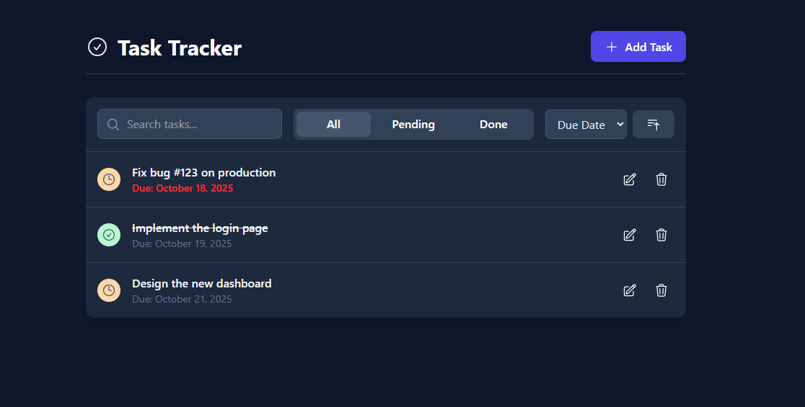
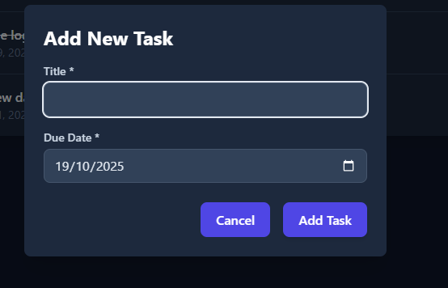
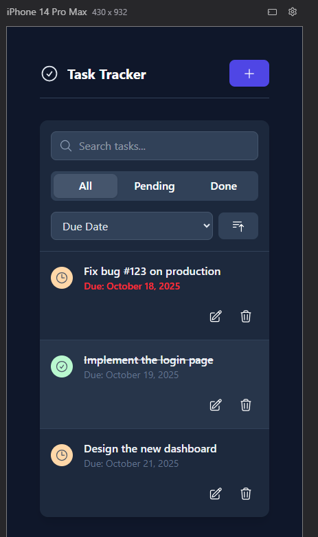
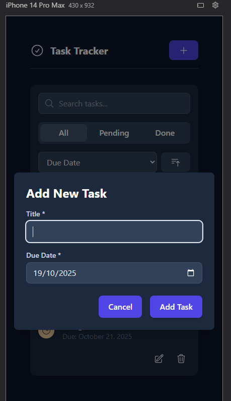

# ✅ Task Tracker App

A simple and clean Task Management application built using **React + TypeScript**.  
It allows users to **add, edit, delete, sort, search, and filter tasks with a smooth UI and modal-based form**.

```bash
git clone https://github.com/prajwalsiwa/Mini-Task-Tracker.git
cd Mini-Task-Tracker
npm install
npm run dev

---

## 🚀 Features

- ➕ Add New Tasks  
- ✏️ Edit Existing Tasks  
- 🗑️ Delete Tasks  
- ✅ Toggle Task Status (Pending ↔ Completed)  
- 🔍 Debounced Search (Optimized & smooth typing experience)  
- 📅 Sort Tasks by:
  - Title (A–Z / Z–A)
  - Due Date (Ascending / Descending)
- 🎯 Filter Tasks by Status:
  - All
  - Pending
  - Completed
- 📌 LocalStorage support to persist tasks  
- 🎭 Modal with validation for Task form (Title & Due Date)

---

## 📁 Folder Structure

src/
├── api/
│   └── TaskApi.ts                // Mock API: get/add/edit/delete tasks (uses LocalStorage for persist)
│
├── components/
│   ├── Header.tsx                // Top bar with title + “Add Task” button
│   ├── TaskFormModal.tsx         // Add/Edit Task Modal with validation
│   ├── TaskItem.tsx              // Single task card (title, date, status, actions)
│   ├── TaskList.tsx              // Renders tasks + sorting + filtering + search
│   ├── DeleteConfirmationModal.tsx // Popup to confirm delete action
│   └── Toast.tsx                 // Reusable toast/notification UI
│
├── hooks/
│   ├── useDebounce.ts            // Debounced search input handler
│   └── useToast.ts               // Toast visibility + message + auto-close logic
│
├── pages/
│   └── TaskTracker.tsx           // Main page: fetches tasks, renders Header + TaskList + modals
│
├── types/
│   └── types.ts                  // Task, Status enums, type definitions
│
├── App.tsx                       // App entry: renders <TaskTracker />
├── main.tsx                      // ReactDOM render entry
└── index.css                     // Global + Tailwind styles


## Screenshots 

   

## Demo video 

https://www.loom.com/share/1d0482a5d8ef4372bc1740c4e72a9e9a?sid=8d9ef5ef-ff49-4f9c-ba86-b71217e63e0d